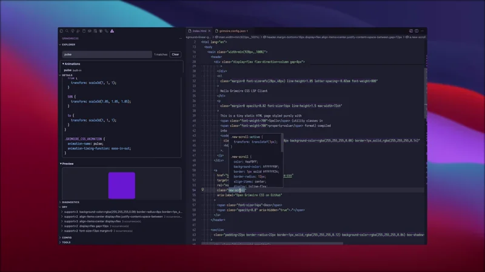

# Grimoire CSS Toolkit

VS Code toolkit for **Grimoire CSS** projects.

Navigate Scrolls/Variables/Functions/Animations, jump to definitions and references, see lint/DRY insights, and use a structured Config view — all powered by the Grimoire CSS Analyzer + LSP.

> This extension activates automatically when your workspace contains `grimoire/config/grimoire.config.json`.

---

## Why this exists

Grimoire CSS encodes styles as **spells**, **variables** (`$name`), reusable **scrolls**, built-in **functions**, and (optionally) **custom animations**.
This extension makes that ecosystem feel “native” in VS Code with feature-focused views and workflows:

- **Editor intelligence**: semantic highlights + hover summary for spells/scrolls/variables.
- **Navigation**: Go to Definition / Find References for Scrolls, Variables, Functions, and Animations.
- **Explorer views**: browse Scrolls/Vars/Functions/Animations discovered from config + `grimoire/animations/*.css`.
- **Details panel** (the “single place”): definition location, reference counts, copy-to-clipboard, and compiled CSS previews.
- **Diagnostics & insights**: run lint + DRY checks and jump to problems directly from results.
- **Refactor (DRY)**: extract repeated spells into a new Scroll definition.
  - Writes the new Scroll into `grimoire.config.json`
  - Auto-refreshes views after applying edits
- **Config visibility**: a structured “Config summary” view (what the engine actually sees):
  - Projects (inputs → outputs)
  - External scroll/variable files
  - Shared spells and other always-output entities
  - Custom animations and CSS custom properties
- **Always up to date**: views refresh automatically as you edit files (debounced watchers).

You can also trigger the same workflow explicitly via:

- `GrimoireCSS: Show Details...` (extension command)
- or LSP-provided code actions (lightbulb / context menu)

---

## Quick start

1. Ensure your repo has a config:
   - `grimoire/config/grimoire.config.json`

2. Open the **Grimoire CSS** activity bar.

3. Run:
   - **GrimoireCSS: Refresh**
   - **GrimoireCSS: Check (Lint + DRY)**

After that, the extension keeps itself up to date:

- It watches your config, `grimoire/**`, and your project input paths.
- It automatically runs refresh / check when relevant files change (debounced).
- The sidebar views and status counts update automatically.

---

## Commands

Open the Command Palette and type “GrimoireCSS:”.

- **GrimoireCSS: Refresh** — refresh Explorer/Details/Config data
- **GrimoireCSS: Check (Lint + DRY)** — run lint + DRY
- **GrimoireCSS: Show Details...** — open Details for the spell/scroll/variable under cursor
- **GrimoireCSS: Explain Token...** — compile a spell/scroll into CSS preview
- **GrimoireCSS: Find Refs...** — find references for scroll / variable / spell
- **GrimoireCSS: Stats...** — stats summary (spells/scrolls/vars)
- **GrimoireCSS: Open Config** — open `grimoire/config/grimoire.config.json`
- **GrimoireCSS: Restart LSP** — restart the LSP process
- **GrimoireCSS: Toggle Editor Highlights**

### Tools (CLI)

These run the Grimoire CSS CLI in an integrated terminal:

- **GrimoireCSS: Build**
- **GrimoireCSS: Init**
- **GrimoireCSS: Shorten**

Requirement: `grimoire_css` must be available in your integrated terminal `PATH`.

---

## Settings

### LSP

- `GrimoireCSS.lsp.path`: absolute path to `grimoire_css_lsp` (optional)
- `GrimoireCSS.lsp.prefer`: `auto` / `local` / `downloaded`
- `GrimoireCSS.lsp.autoDownload`: allow downloading released LSP into global storage

### Editor highlights

- `GrimoireCSS.editorHighlights.enable`
- `GrimoireCSS.editorHighlights.color`
- `GrimoireCSS.editorHighlights.style`
- `GrimoireCSS.editorHighlights.overviewRuler`

### Diagnostics / logs

- `GrimoireCSS.trace`: `off` / `messages` / `verbose`
- `GrimoireCSS.timeouts.executeCommandMs`

---

## Troubleshooting

### The sidebar is empty

Check:

- your workspace contains `grimoire/config/grimoire.config.json`
- run **GrimoireCSS: Refresh**

### Build/Init/Shorten commands do nothing

These commands run the CLI in a terminal. Check:

- `grimoire_css` is installed and in terminal `PATH`
- the integrated terminal uses the same shell environment you expect

### LSP doesn’t start

- Set `GrimoireCSS.lsp.path` to a known-good `grimoire_css_lsp`
- Or keep `GrimoireCSS.lsp.prefer=auto` and enable `GrimoireCSS.lsp.autoDownload`

---

## Privacy & Security

- No scripts are executed from your workspace.
- If `GrimoireCSS.lsp.autoDownload=true`, the extension may download a released LSP binary from GitHub into VS Code global storage.

---

## Links

- Repository: <https://github.com/persevie/grimoire-css>
- Issues: <https://github.com/persevie/grimoire-css/issues>
